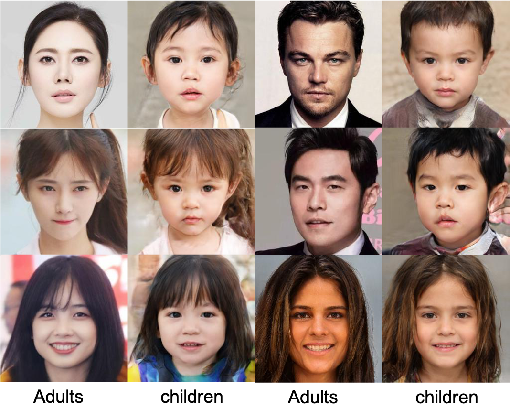

# Morph-UGATIT
a morph transfer UGATIT for image translation.




# Introduction

This is Pytorch implementation of UGATIT, paper "U-GAT-IT: Unsupervised Generative Attentional Networks with Adaptive Layer-Instance Normalization for Image-to-Image Translation".

Additionally, I DIY the model by adding two modules, a MLP module to learn a latent zone and an identity preserving loss. These two factors make UGATIT to achieve a progressive domain transfer for image translation. I call this method Morph UGATIT.

My work has two aspects:
* Firstly, according to official TensorFlow code of UGATIT, I use PyTorch to reimplement it, very close to original TF model including network, training hyper parameters.
* I add a MLP module, introducing a latent code for generator. And an identity preserving loss is used to learn more common feature for different domains.

I train model on two datasets, "adult2child" and "selfie2anime".

# Requirements
* python3.7
* Pytorch >= 1.6
* dlib. Before installing dlib, you should install Cmake and Boost
```
pip install Cmake
pip install Boost
pip install dlib
```
* other common-used library.

# How to Use
There are many models in my repo, but you just need two models and corresponding python script files.
* UGATIT: "configs/cfgs_ugatit.py", "models/ugatit.py", "tool/train_ugatit.py"
* Morph UGATIT: "configs/cfgs_s_ugatit_plus.py", "models/s_ugatit_plus.py", "tool/train_s_ugatit_plus.py"

### train step
1. getting dataset. The "adult2child" dataset comes from G-Lab, which is generated by StyleGAN. You can download [here](http://www.seeprettyface.com/mydataset.html)


The "selfie2anime" dataset comes from official UGATIT repo. 

2. set configurations. configuration files can be found "configs" dir. You just focus on "cfgs_ugatit.py" and "cfgs_s_ugatit_plus.py". Please change:
* dirA: domain A dataset path.
* dirB: domain B dataset path.
* anime: whether dataset is "selfie2anime".
* tensorboard: tensorboard log path.
* saved_dir: save model weight into "saved_dir".

3. start to train.
```
cd tool
python train_ugatit.py   # ugatit
python train_s_ugatit_plus.py   #  morph ugatit
```
you can also use tensorboard to check loss curves and some visualizations.
